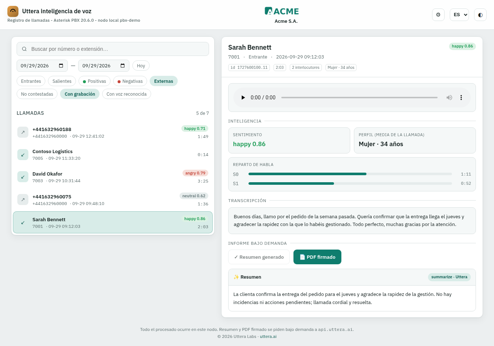
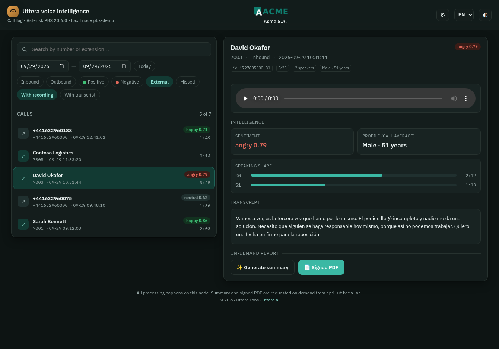
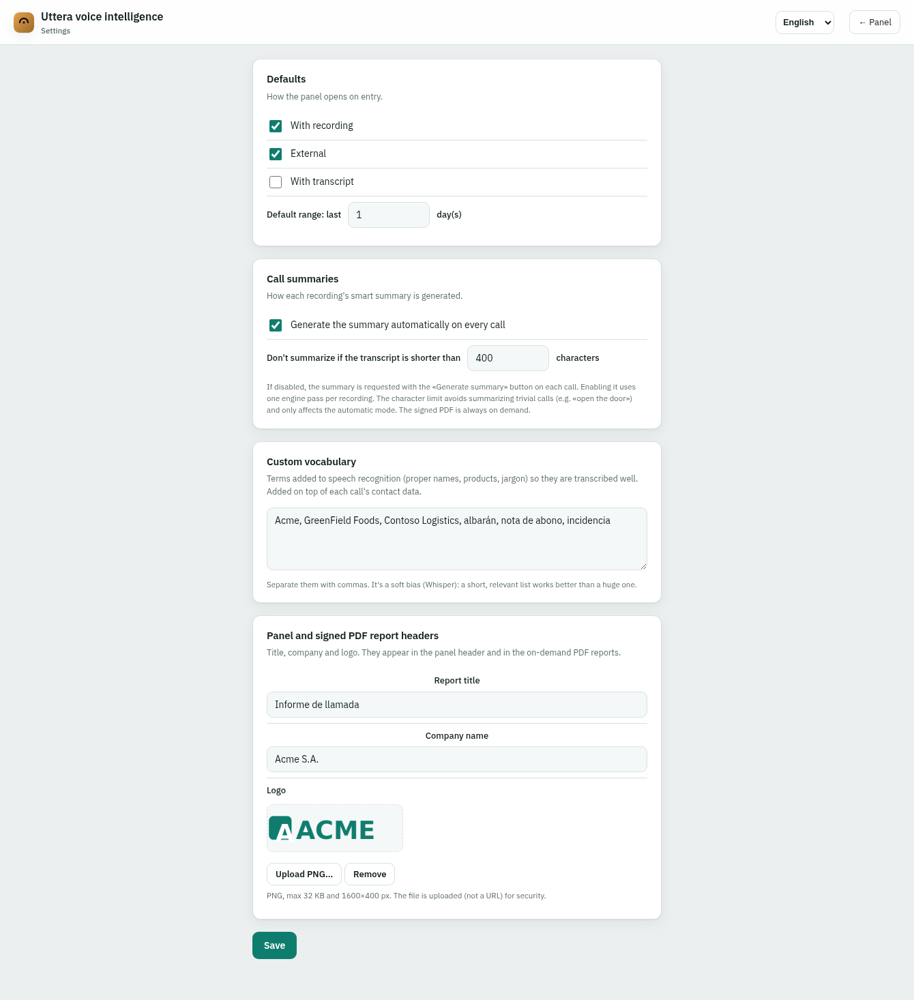

# Panel de llamadas de Uttera

*[English version](README.md)*

Una vista web de solo lectura del registro de llamadas de tu centralita. Une el
CDR con las transcripciones y la inteligencia que el conector de
[grabaciones](../recordings/) ya deja junto a cada `.wav`, y muestra una fila por
llamada con su transcripción, sentimiento, interlocutores y perfil del hablante.
Para las llamadas que el administrador necesite, un clic le pide a
`api.uttera.ai` un **resumen** o un **PDF firmado**.

```
server.py     solo stdlib, sin pip install. Lee el CDR + el directorio monitor.
panel.html    la lista de llamadas y el detalle que sirve.
settings.html la página /settings: encabezados, logotipo y opciones.
```

Es el panel que corremos en producción, con lo específico del sitio quitado. La
interfaz viene en cuatro idiomas (castellano, inglés, francés y alemán); toma
uno del navegador y recuerda la elección.

## Qué aspecto tiene

La lista de llamadas con una abierta: transcripción, sentimiento, reparto de
habla y perfil del hablante, más el resumen bajo demanda y el botón de PDF firmado:



Todo el texto está traducido y tiene tema oscuro; el mismo panel en inglés, en
una llamada que el modelo marcó como negativa:



La página de ajustes: vista por defecto, automatización del resumen, vocabulario
personalizado y los encabezados que marcan el panel y el informe PDF firmado:



*(Las capturas son una centralita de demostración con llamadas sintéticas; sin
datos reales.)*

## Qué necesita

Tu centralita ya graba llamadas y el conector de grabaciones ya escribe
`<uniqueid>.txt` y `<uniqueid>-analysis.json` (o el antiguo `-description.txt`)
junto a cada `<uniqueid>.wav`. Este panel lee eso y el CDR
(`cdr-csv/Master.csv`). **Nunca escribe** en ellos.

## Instalación

```bash
sudo mkdir -p /opt/uttera-panel
sudo cp server.py panel.html settings.html /opt/uttera-panel/
sudo cp uttera-panel.env.example /etc/uttera/panel.env
sudo chmod 600 /etc/uttera/panel.env          # lleva tu clave de API
sudoedit /etc/uttera/panel.env                # pon al menos PANEL_PASS
sudo cp uttera-panel.service /etc/systemd/system/
sudo systemctl enable --now uttera-panel
```

Escucha en `127.0.0.1:8973`. Ponlo detrás de tu proxy HTTPS: sirve grabaciones y
transcripciones, que son datos personales.

## Lo que cuesta un día descubrir

**Una fila por llamada, no una por pata de Dial.** Asterisk escribe un registro
CDR por intento de Dial y por paso de aplicación, todos con el mismo `uniqueid`
de la llamada y una sola grabación. El panel los colapsa: contestada si alguna
pata contestó, duración = la pata más larga, inicio = la más temprana. Sin esto,
un grupo de salto muestra la misma llamada una docena de veces.

**El CDR grande se lee por la cola.** `Master.csv` crece sin límite y es de solo
añadir, así que la vista reciente salta a los últimos MB en vez de leer el
fichero entero. `PANEL_TAIL_BYTES` controla cuánto hacia atrás.

**El sentido es una conjetura.** cdr-csv no registra entrante/saliente. El panel
lo deduce primero de la tecnología del canal —una llamada originada en una
troncal es entrante; un canal interno que marca a una troncal es saliente— y
recurre a la longitud de la extensión cuando los canales son ambiguos. En una
troncal que presenta tu propio número principal como identificador de las
llamadas salientes, la regla de longitud sola las etiquetaría como entrantes;
por eso la tecnología manda. Ajusta `PANEL_TRUNK_TECH`, `PANEL_INTERNAL_TECH` y
`PANEL_EXT_MAXLEN` a tu plan de numeración.

**Los ajustes viven en un JSON, no en el código.** La página `/settings` escribe
los encabezados del panel y del informe, el logotipo subido y las opciones del
proceso de grabación (resumen automático sí/no, longitud mínima de transcripción
y un vocabulario personalizado para el reconocimiento de voz) en `PANEL_SETTINGS`.
El conector de grabaciones lee ese mismo fichero, así que los resúmenes y el
vocabulario se cambian sin tocar ninguno de los dos.

**El PDF firmado necesita plan de pago.** La transcripción y la inteligencia
salen de ficheros que ya tienes, sin clave. El **resumen** y el **PDF firmado**
bajo demanda llaman a `api.uttera.ai`; el informe PDF (`report=pdf`) requiere
plan Developer o superior. La clave va en `panel.env`, nunca en el dialplan.

**El resumen y el informe se cobran una vez cada uno.** Al pulsar *Generar
resumen*, el panel guarda la respuesta como `<uniqueid>-summary.json` en
`PANEL_CACHE`; al reabrir la llamada muestra el resumen guardado con el botón
deshabilitado. El PDF firmado se cachea igual, como `<uniqueid>-report.pdf`: una
segunda pulsación sirve ese mismo fichero en vez de pagar por uno nuevo —que, al
no ser el modelo determinista, saldría *distinto*—. El botón pasa a *Ver informe
firmado*. Para forzar uno nuevo tras cambiar la marca, pide
`/api/report/<id>?force=1`. El resumen automático escribe su resumen en
`PANEL_MONITOR` y el panel lee de los dos, así que las dos vías comparten una
sola caché. El unit que se entrega deja el spool de solo lectura
(`ProtectSystem=strict`); por eso `PANEL_CACHE` es un directorio escribible
propio: sin él, las escrituras fallan en silencio y cada pulsación vuelve a pagar.

**La autenticación no es opcional.** Con `PANEL_PASS` vacío el panel queda
abierto, y sirve grabaciones. Ponla, y deja el panel en localhost tras TLS.
